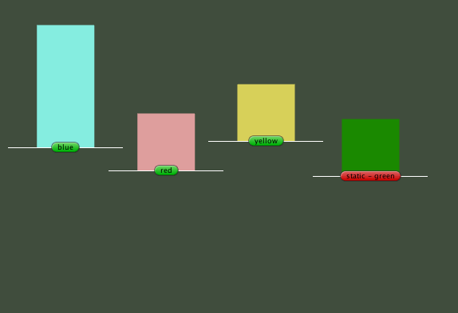

# SpriteSort-for-Unity-5.x

 Unity-5.x 精灵排序，解决：1. 精灵层级显示（根据高度来设置z轴深度）2. [Z-fighting](https://blog.csdn.net/pizi0475/article/details/6720595)（深度冲突）
 
 

### Usga

Simply attach "SpriteSort" to game object which with "SpriteRenderer".

### Reference：

1. [Unity 开发 2.5D 游戏的精灵层级顺序设置](https://blog.csdn.net/byeweiyang/article/details/80128877)
2. [z-fighting在unity中的解决方式](https://blog.csdn.net/tinyhum3d/article/details/7256040)
3. [Sprite Renderer](https://docs.unity3d.com/Manual/class-SpriteRenderer.html#sortpoint)

------

LICENSE [MIT](LICENSE)